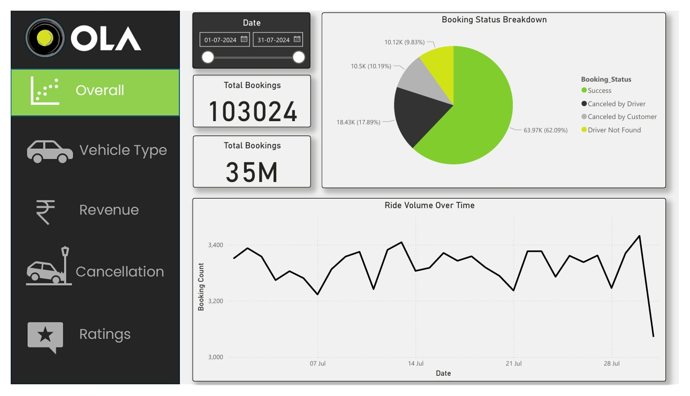
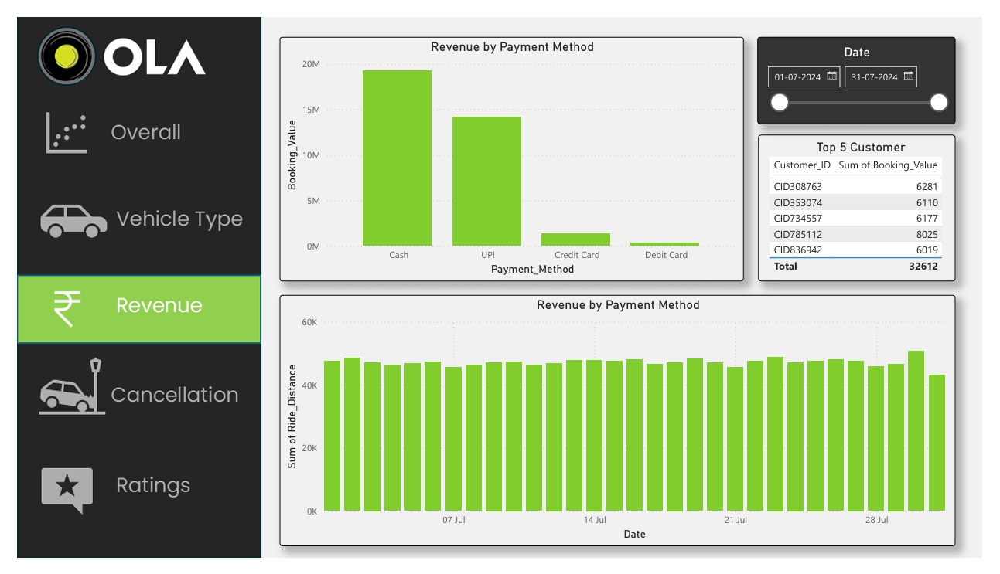
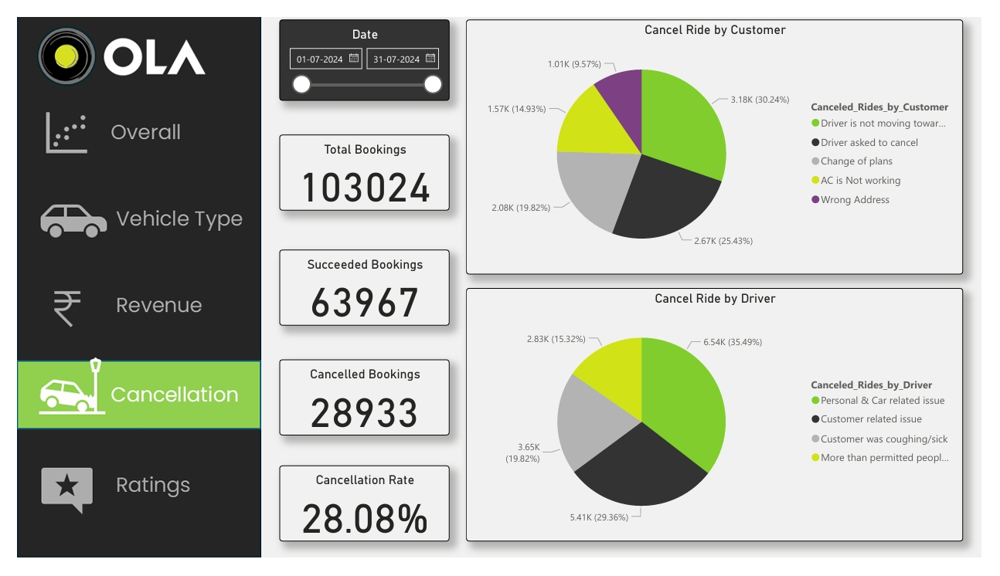

# 🚖 OLA Ride Analytics Dashboard – Power BI Project

## 📌 Project Overview
The **OLA Ride Analytics Dashboard** is a Power BI project that analyzes ride booking data for a cab aggregator platform (similar to Ola/Uber).  
It provides **insights into ride volume, booking trends, cancellations, payment behavior, top customers, and operational performance** to help business teams make data-driven decisions.

---

## 🎯 Objectives
- Analyze **ride booking trends** over time.
- Track **successful vs canceled bookings** and understand reasons for cancellations.
- Measure **revenue performance by payment method**.
- Identify **top-performing customers** and their contribution to revenue.
- Enable stakeholders to **monitor KPIs and optimize operations**.

---

## 🛠️ Tech Stack
- **Power BI Desktop** – For visualization and data modeling  
- **Data Source** – CSV/Excel data (simulated OLA ride dataset)  
- **Power Query** – For ETL (Extract, Transform, Load) operations  
- **DAX (Data Analysis Expressions)** – For calculated measures and KPIs  
- **Excel/CSV** – For input data files  

---

## 📊 Key Insights from the Dashboard
1. **Ride Volume Over Time:**  
   Visualizes daily booking counts and trends to identify demand fluctuations.

2. **Booking Status Breakdown:**  
   - Successful bookings  
   - Canceled by Driver  
   - Canceled by Customer  
   - Driver Not Found  

3. **Revenue Analysis:**  
   Tracks total booking value and breakdown by **payment methods (Cash, UPI, Credit/Debit Cards)**.

4. **Cancellations Analysis:**  
   - Top reasons for **customer cancellations**  
   - Top reasons for **driver cancellations**

5. **Top 5 Customers:**  
   Displays customers contributing the most to revenue and booking counts.

6. **Ride Distance by Hour:**  
   Tracks hourly ride distance to understand travel peaks and demand patterns.

7. **Performance KPIs:**  
   - Total Bookings  
   - Successful Bookings  
   - Canceled Bookings  
   - Total Booking Value  

---

## 📷 Dashboard Previews
### Ride Volume & Booking Status

### Revenue by Payment Method

### Cancellations Analysis

---

## 🚀 Features
- **Interactive Filters:** Date range filters for flexible analysis.  
- **Dynamic KPIs:** Real-time calculation of bookings, revenue, and cancellations.  
- **Business-Oriented Insights:** Helps identify operational bottlenecks and improve customer experience.  

---

## 📈 Business Impact
- Helps business teams **track operational efficiency**.
- Provides **actionable insights to reduce cancellations**.  
- Supports **data-driven decisions for customer engagement strategies**.

---

## 📝 How to Use
1. Download the `.pbix` file from this repository.
2. Open it in **Power BI Desktop**.
3. Connect to the provided sample dataset (or replace it with your own ride data).
4. Explore insights using the dashboard visuals and filters.

---

## 🧑‍💻 Author
**Ayush Charjan**  
Data Analyst | Power BI Developer | AI & Data Science Enthusiast  

- 💼 [LinkedIn](https://www.linkedin.com/in/ayush-charjan-9a7a43229)  
- 📧 Email: ayushcharjan4@gmail.com

---

## 📄 License
This project is for **educational and portfolio purposes only**.  
All data used is simulated and not affiliated with the official OLA company.

---
